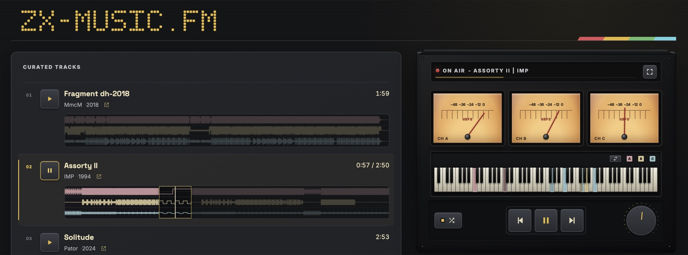

# ZX-MUSIC.FM

A web player for a curated collection of ZX Spectrum AY/YM chip music.

Nothing here is a recording. Each track is prepared offline into a finite,
seekable YM6 register stream, and the browser plays it by running a real YM2149
sound-chip emulator compiled to WebAssembly — the same three square-wave channels
the original hardware had, rendered a sample at a time while you listen.



## What it does

- **Real per-channel visuals.** The A/B/C channels stay separate all the way to
  the output, so the three waveform lanes, the three VU meters, and the piano
  keyboard show what each chip channel is actually doing — not a post-hoc
  analysis of a stereo mix.
- **Sample-exact seeking.** The upstream engine cannot restore tone, noise, and
  envelope phase on a seek, so the player reconstructs the chip state by
  rendering deterministically from the beginning to the target sample.
- **Stereo placement you control.** Channel order cycles through ABC, ACB, and
  BAC, remapping the live audio without interrupting playback.
- **Shuffle, auto-advance, and resume.** Volume, channel order, selected track,
  and playback position survive a reload.
- **Media Session integration**, so hardware and OS media keys work.
- **A distraction-free deck**, on desktop and in mobile landscape.
- **Accessible controls.** Keyboard operation, visible focus, non-colour state
  communication, a conventional slider fallback when canvas or waveform data
  fails, and a WCAG 2.2 AA target checked by automated axe scans.
- **No tracking of any kind.** No analytics, cookies, telemetry, advertising,
  service worker, or third-party requests. Fonts, code, images, audio, and
  generated data are all self-hosted behind a restrictive CSP.

The committed catalog currently holds 24 tracks by 14 authors, from 1987 to 2024,
about 70 minutes in total. Catalog size is a curatorial choice rather than a
constraint; a valid catalog may hold any number of tracks, including none.

Cold-load transfer is about 194 KB against a 500 KB budget. The 1.3 MB
WebAssembly engine and the music itself load lazily, only after a user gesture
permits audio.

## How it works

Content preparation is deterministic, runs on a curator's machine, and its output
is committed to the repository:

```
content/tracks/<permanent-id>/
  source.pt3                     authoritative bytes, never modified
    │
    │  ZXTune in a pinned, network-disabled container (tracker formats only)
    ▼
  generated/source.psg           intermediate register dump
  generated/tracker-conversion.json
    │
    │  project-owned PSG → YM6, plus a dry offline render at 48 kHz
    ▼
  generated/playback.ym          finite, seekable runtime stream
  generated/waveform.bin         2,048 min/max peaks per channel
  generated/provenance.json      source hashes, formats, engine pin
    │
    ▼
public/generated/                content-hashed, immutable public assets
  catalog.json                   the only file the browser discovers
  tracks/<id>.<sha256>.ym
  waveforms.<sha256>.bin         every track's peaks in one pack
```

At runtime the browser fetches `catalog.json`, verifies every asset's SHA-256
against the catalog before use, then lazily loads the engine and renders:

```
YM6 registers → WASM YM2149 → 3 discrete channels → stereo router (ABC/ACB/BAC)
              → high-pass → bass shelf → limiter → low-pass → volume → output
                                    └─ analyser taps feed meters, keyboard, and
                                       the oscilloscope lens
```

Because preparation is deterministic, `npm run content:validate` can re-derive
every artifact from the authoritative sources and byte-compare it against what is
committed. That check runs inside `npm run build`, so a change that alters
rendered audio by a single sample fails the build rather than shipping quietly.

## Getting started

Requires Node.js 24.14.1 and npm 11.12.1 (see `.nvmrc`). Install exactly from the
lockfile:

```sh
npm ci
npm run dev
```

No Docker, network access, or Rust toolchain is needed to run, test, or build the
site — only to import tracker-format music or rebuild the engine.

## Commands

| Command                    | What it does                                                    |
| -------------------------- | --------------------------------------------------------------- |
| `npm run dev`              | Vite dev server                                                 |
| `npm run build`            | Validates content, verifies the engine, typechecks, then builds |
| `npm run preview`          | Serves the production build from `dist`                         |
| `npm run typecheck`        | `tsc --noEmit`                                                  |
| `npm run lint`             | ESLint, zero warnings tolerated                                 |
| `npm run format:check`     | Prettier                                                        |
| `npm test`                 | Unit and component suites, including real WASM rendering        |
| `npm run test:e2e`         | Playwright journeys against the production build                |
| `npm run engine:verify`    | Checks the vendored engine against its pin and hashes           |
| `npm run content:generate` | Re-derives every generated artifact                             |
| `npm run content:validate` | Byte-compares committed artifacts against a fresh derivation    |

`npm run engine:rebuild` is an exceptional maintainer command that rebuilds the
pinned browser engine from source. It needs Rust 1.88.0, the
`wasm32-unknown-unknown` target, and `wasm-bindgen-cli` 0.2.105.

## Adding music

Tracks are managed through the CLI, never by hand. Import, update, and remove all
stage their work in a temporary directory, regenerate, validate, and only then
atomically replace the repository's content directories, so a failed download or
conversion cannot leave partial state behind.

```sh
npm run content:import -- \
  --file ./track.psg --non-interactive \
  --id track-id --order 2 --title "Track" --author "Author" \
  --source-url https://example.com/source \
  --chip-type AY --chip-clock-hz 1773400 --frame-rate-hz 50 \
  --channel-layout ABC

npm run content:update -- --id track-id --title "Corrected Title"
npm run content:remove -- --id track-id --yes
```

Either `--file` or an HTTPS `--url` supplies the bytes. Remote retrieval is
deliberately narrow: HTTPS only, no credentials in the URL, DNS resolved and
pinned before connecting, private and reserved address ranges refused, every
redirect re-validated, and downloads capped at 16 MiB. The retrieval URL stays
separate from the required human-facing `--source-url`.

Permanent IDs never change. `content:update` requires `--replace-source` before it
will replace authoritative bytes, and `content:remove` prints its exact target
before asking for confirmation.

**Formats.** AY, YM, and PSG are prepared with Node alone. PT3, STC, ASC, STP, and
FTC additionally require Docker Desktop: the importer builds a Linux `zxtune123`
image from pinned commit `8e8228ee8c1fa0bb5e63e5c8254603aa86bcef2a`, confirms
ZXTune's detected module type matches the file extension, and converts to an
intermediate PSG inside a read-only, network-disabled, capability-free container.
The resulting conversion is committed with its hashes, so later builds and
deployments need neither Docker nor network access.

## Attribution and licensing

The code in this repository is MIT licensed; see [LICENSE](LICENSE).

The music is not. Each track remains the work of its author, and every catalog
entry carries a `sourceUrl` pointing at where it was published — currently
[ZX-Art](https://zxart.ee/eng/music/) for most of them, plus ZXTunes, CVGM,
Bulba's archive, and Demozoo. That link is the catalog's sole per-track
attribution field: no per-track license metadata is invented, and the bundled
music is not exposed through download controls. If you are an author and would
like a track removed, please open an issue.

## Project conventions

[AGENTS.md](AGENTS.md) is the authoritative product and technical specification.
It documents the architecture, the invariants that look optimizable but are not,
the performance budgets, and the verification workflow. Read it before changing
playback, the content pipeline, or the generated artifacts.
